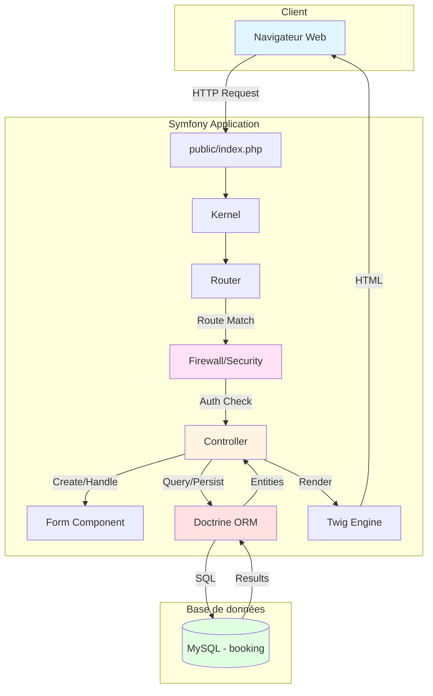
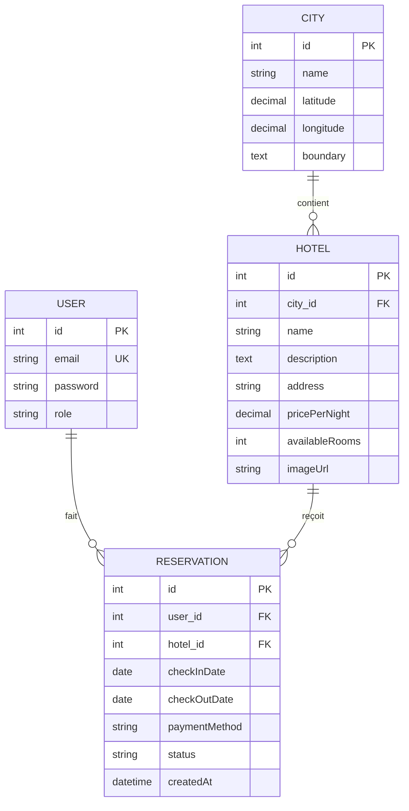
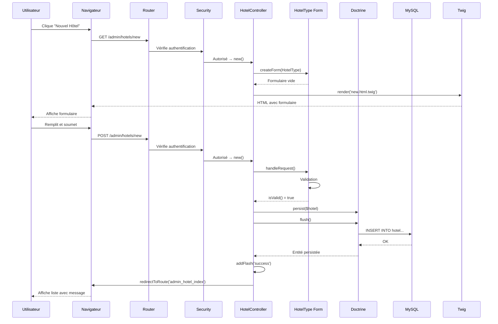

# 🎨 DIAGRAMMES MERMAID - SMARTSTAY

Ce document contient les définitions Mermaid des diagrammes d'architecture.
Vous pouvez les copier-coller dans un éditeur Mermaid en ligne pour les visualiser.

**Éditeur en ligne** : https://mermaid.live/

---

## 📊 DIAGRAMME 1 : ARCHITECTURE - FLUX DE REQUÊTE

### Description
Ce diagramme montre le flux d'une requête HTTP dans l'application Symfony.

### Code Mermaid

---

## 🗄️ DIAGRAMME 2 : RELATIONS ENTRE ENTITÉS

### Description
Ce diagramme montre les relations entre les entités du projet (User, Hotel, City, Reservation).

### Code Mermaid

---

## 🔄 DIAGRAMME 3 : CYCLE DE VIE D'UNE REQUÊTE CRUD

### Description
Ce diagramme montre le cycle de vie complet d'une requête de création d'hôtel (POST).

### Code Mermaid

---

## 🎯 COMMENT UTILISER CES DIAGRAMMES

### Option 1 : Éditeur en ligne
1. Aller sur https://mermaid.live/
2. Copier le code Mermaid
3. Coller dans l'éditeur
4. Le diagramme s'affiche automatiquement
5. Exporter en PNG/SVG si besoin

### Option 2 : VSCode
1. Installer l'extension "Markdown Preview Mermaid Support"
2. Ouvrir ce fichier dans VSCode
3. Cliquer sur "Preview" (Ctrl+Shift+V)
4. Les diagrammes s'affichent dans la prévisualisation

### Option 3 : GitHub
1. Pousser ce fichier sur GitHub
2. GitHub affiche automatiquement les diagrammes Mermaid

---

## 📝 EXPLICATION DES DIAGRAMMES

### Diagramme 1 : Architecture
**Utilité** : Expliquer le flux d'une requête HTTP
**Points clés** :
- Point d'entrée : `public/index.php`
- Kernel initialise l'application
- Router trouve la route
- Security vérifie l'authentification
- Controller gère la logique
- Doctrine communique avec la BDD
- Twig génère le HTML

### Diagramme 2 : Relations
**Utilité** : Expliquer le modèle de données
**Points clés** :
- User fait plusieurs Reservations (1-N)
- Hotel reçoit plusieurs Reservations (1-N)
- City contient plusieurs Hotels (1-N)
- Clés primaires (PK) et étrangères (FK)

### Diagramme 3 : Cycle CRUD
**Utilité** : Expliquer le processus de création d'un hôtel
**Points clés** :
- GET : Affiche le formulaire vide
- POST : Traite la soumission
- Validation du formulaire
- persist() + flush() pour sauvegarder
- Redirection avec message flash

---

## 🎬 UTILISATION PENDANT LA VALIDATION

### Quand montrer ces diagrammes ?
1. **Diagramme 1** : Quand le professeur demande "Comment fonctionne Symfony ?"
2. **Diagramme 2** : Quand le professeur demande "Expliquez votre modèle de données"
3. **Diagramme 3** : Quand le professeur demande "Comment créez-vous un hôtel ?"

### Comment les montrer ?
- Option 1 : Ouvrir https://mermaid.live/ avec le diagramme pré-chargé
- Option 2 : Avoir une capture d'écran prête
- Option 3 : Dessiner au tableau en s'inspirant du diagramme

---

## 💡 CONSEILS

### Pour expliquer le Diagramme 1
> "Quand un utilisateur accède à une page, la requête HTTP arrive sur index.php, qui initialise le Kernel. Le Router analyse l'URL et trouve la route correspondante. Le Firewall vérifie l'authentification. Ensuite, le Controller est appelé, il peut utiliser Doctrine pour accéder à la base de données, et Twig pour générer le HTML."

### Pour expliquer le Diagramme 2
> "Mon modèle de données est composé de 4 entités principales. Un User peut faire plusieurs Reservations. Un Hotel peut recevoir plusieurs Reservations. Une City contient plusieurs Hotels. Les relations sont gérées par Doctrine avec des clés étrangères."

### Pour expliquer le Diagramme 3
> "Quand je crée un hôtel, il y a deux requêtes. D'abord un GET qui affiche le formulaire vide. Ensuite, quand l'utilisateur soumet, un POST est envoyé. Le formulaire est validé, puis Doctrine persiste l'entité et exécute l'INSERT en base de données. Enfin, je redirige vers la liste avec un message de succès."

---

**Ces diagrammes vous aideront à expliquer visuellement l'architecture ! 🚀**
